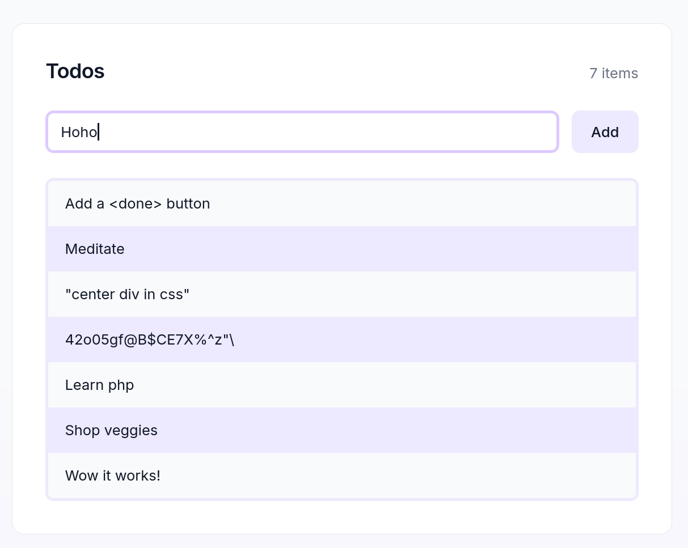

# first-laravel

A minimal Todo app built to learn Laravel, PHP, and SQLite.

## Goal

- Learn Laravel fundamentals / CLI
- Practice PHP in a real project
- Understand database connections and migrations

## Incredible features

- Add a todo
- Done/Undo task
- Delete a todo
- Night mode following system default

## Usage

Start the Laravel development server and the Vite dev server (for Tailwind).

```sh
php artisan serve
npm run dev
```

Run the database migrations.
```sh
php artisan migrate
```

If you are using Nix, a dev shell with php, composer, tailwind, nodejs and sqlite is provided.
```sh
nix-shell
```

## Screenshot



## Notes

- Some sections were llm-generated to focus on the learning goals.

## License

MIT
